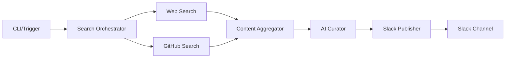

# Nixtla Search-to-Slack MVP Planning Document

**Document ID**: 011-PP-PLAN
**Created**: 2025-11-23
**Type**: Product Planning - MVP Specification
**Status**: Planning Complete
**Version**: 1.0.0

---

## Executive Summary

This document defines the implementation plan for a Nixtla-focused "Search-to-Slack Digest" plugin MVP. This is positioned as a **construction kit and reference implementation**, not a production service or Nixtla-endorsed product.

The plugin demonstrates how to build automated content discovery and curation for time-series/forecasting practitioners, with clear constraints on scope and honest messaging about capabilities.

---

## Implementation Phases

### Phase 0: Conceptual Architecture (COMPLETED)
**Status**: ✅ Documented

- Initial architecture concepts documented
- Use cases identified
- Technology stack selected
- Integration patterns defined

**Deliverables**:
- Architecture concepts in repository documentation
- Initial release v0.1.0 with plugin concepts

### Phase 1: MVP Implementation (CURRENT)
**Status**: 🚧 In Development
**Scope**: Minimal viable functionality with clear constraints

#### 1.1 Sources (LIMITED SCOPE)
**Web Search**:
- Provider: SerpAPI or similar (configurable interface)
- Scope: Time-series, forecasting, and Nixtla-related queries ONLY
- Max results: 10 per search
- Time range: Last 7 days default

**GitHub Search**:
- Primary: Nixtla organization repositories
- Secondary: Small allowlist of related repos (max 5)
- Content types: Issues, PRs, Releases, Discussions
- Max results: 20 per search

**EXPLICITLY EXCLUDED FROM MVP**:
- ❌ Reddit monitoring
- ❌ Twitter/X integration
- ❌ Academic papers (arXiv, etc.)
- ❌ YouTube videos
- ❌ Podcasts
- ❌ Blog RSS feeds

#### 1.2 Features (BASIC FUNCTIONALITY)

**Deduplication**:
- Simple URL normalization (lowercase, strip tracking params)
- Case-insensitive title comparison
- NO advanced similarity algorithms (TF-IDF, embeddings, etc.)

**AI Curation**:
- Single LLM call per item
- Returns structured JSON:
  - `summary`: 2-3 sentences
  - `key_points`: 2-3 bullet points
  - `why_it_matters`: 1-2 sentences for Nixtla/time-series context
  - `relevance_score`: 0-100 (heuristic + optional LLM refinement)

**Slack Publishing**:
- Post to single configurable channel
- Use Slack Block Kit for formatting
- Include timestamp, item count
- Per-item blocks with summary, bullets, link
- Handle rate limits gracefully

#### 1.3 Triggering (MANUAL FOCUS)

**Implemented**:
- CLI command: `python -m nixtla_search_to_slack --topic <topic_id>`
- Plugin command: `/nixtla-digest [topic]` (if plugin framework supports)

**Documented but NOT fully implemented**:
- Cron job example (local machine)
- GitHub Actions workflow template
- Cloud scheduler patterns (GCP, AWS)

### Phase 2+: Future Roadmap (NOT IMPLEMENTED)
**Status**: 📋 Documented Only
**Timeline**: Post-MVP, pending feedback

#### Phase 2: Enhanced Features
- **Advanced Deduplication**: TF-IDF, semantic similarity
- **Multi-source expansion**: RSS feeds, newsletters, academic papers
- **Personalization**: User preferences, reading history
- **Threading**: Slack thread updates for ongoing topics
- **Metrics**: Click tracking, engagement analytics

#### Phase 3: Scale & Reliability
- **Multi-channel support**: Different digests for different audiences
- **Queue-based architecture**: Celery/RQ for async processing
- **Database persistence**: PostgreSQL for history, dedup cache
- **Error recovery**: Retry logic, dead letter queues
- **Monitoring**: Prometheus metrics, alerting

#### Phase 4: ML & Intelligence
- **Smart summarization**: Fine-tuned models for time-series domain
- **Trend detection**: Identify emerging topics
- **Anomaly alerting**: Unusual activity in Nixtla ecosystem
- **Recommendation engine**: Suggest related content
- **Multi-language support**: Spanish, Portuguese summaries

---

## Critical Disclaimers & Constraints

### What This Plugin IS:
✅ **Construction Kit**: Example implementation for learning and adaptation
✅ **Reference Implementation**: Shows patterns for search → AI → Slack workflow
✅ **MVP Demonstration**: Minimal viable features to prove concept
✅ **Open Source Example**: MIT licensed, free to modify

### What This Plugin IS NOT:
❌ **Production Service**: Not a managed, always-on service
❌ **Nixtla Product**: Not endorsed, operated, or supported by Nixtla
❌ **Monitoring System**: Not suitable for critical alerting or observability
❌ **Complete Solution**: Many features intentionally deferred to future phases

### Technical Limitations (MVP):
- **Search Coverage**: Limited to 2 sources (web + GitHub)
- **Deduplication**: Basic string matching only
- **Scalability**: Single-threaded, no queue system
- **Error Handling**: Basic retry, may miss content on failures
- **History**: No persistence, may re-send duplicates
- **Customization**: Limited configuration options

### Operational Limitations:
- **No SLA**: No uptime guarantees
- **No Support**: Community-driven, best-effort
- **No Hosting**: User must deploy/run themselves
- **No Monitoring**: User must implement their own observability

---

## Technical Architecture (MVP)

### Component Structure
```
plugins/nixtla-search-to-slack/
├── src/nixtla_search_to_slack/
│   ├── __init__.py
│   ├── main.py                 # CLI entry point
│   ├── search_orchestrator.py  # Coordinate searches
│   ├── content_aggregator.py   # Deduplicate content
│   ├── ai_curator.py          # LLM summaries
│   ├── slack_publisher.py     # Slack formatting
│   └── config_loader.py       # YAML configuration
├── config/
│   ├── sources.yaml           # Search sources config
│   └── topics.yaml           # Topic definitions
├── tests/
│   ├── test_*.py             # Unit tests
│   └── conftest.py          # Test fixtures
├── README.md                 # Plugin documentation
├── requirements.txt          # Python dependencies
└── .env.example             # Environment template
```

### Data Flow (MVP)


### Configuration Schema

**sources.yaml**:
```yaml
sources:
  web:
    provider: serpapi
    max_results: 10
    time_range: 7d
    base_queries:
      - "Nixtla TimeGPT"
      - "time series forecasting Python"

  github:
    organizations:
      - Nixtla
    additional_repos:
      - "facebook/prophet"  # Example related repo
    max_results: 20
```

**topics.yaml**:
```yaml
topics:
  nixtla-updates:
    name: "Nixtla Ecosystem Updates"
    keywords:
      - TimeGPT
      - StatsForecast
      - MLForecast
      - NeuralForecast
    sources: [web, github]

  timeseries-research:
    name: "Time Series Research"
    keywords:
      - "time series forecasting"
      - "temporal prediction"
      - "ARIMA alternatives"
    sources: [web]
```

---

## Implementation Checklist (Phase 1 MVP)

### Core Modules
- [ ] `main.py` - CLI entry point with argparse
- [ ] `search_orchestrator.py` - Search coordination
- [ ] `content_aggregator.py` - Simple deduplication
- [ ] `ai_curator.py` - LLM integration
- [ ] `slack_publisher.py` - Block Kit formatting
- [ ] `config_loader.py` - YAML parsing

### Configuration
- [ ] `sources.yaml` - Nixtla-focused sources
- [ ] `topics.yaml` - 2-3 example topics
- [ ] `.env.example` - Required environment variables

### Tests
- [ ] Unit tests for each module
- [ ] Mocked external services
- [ ] 80% code coverage target

### Documentation
- [ ] Plugin README with honest positioning
- [ ] Installation instructions
- [ ] Configuration guide
- [ ] Example usage
- [ ] Clear limitations section

### Integration
- [ ] Add to main repository README
- [ ] Update GitHub Pages if applicable
- [ ] CI/CD pipeline integration

---

## Success Criteria (MVP)

### Functional Requirements
✅ Successfully searches web for Nixtla-related content
✅ Successfully searches GitHub Nixtla org
✅ Deduplicates obvious duplicates
✅ Generates AI summaries for each item
✅ Posts formatted digest to Slack
✅ Handles basic errors gracefully

### Quality Requirements
✅ All tests passing
✅ Documentation accurate and honest
✅ No overpromising of capabilities
✅ Clear labeling of future vs current features
✅ Code is readable and maintainable

### Non-Functional Requirements
✅ Runs in < 60 seconds for typical digest
✅ Uses < 500MB memory
✅ Costs < $0.10 per digest in API calls
✅ Works with Python 3.8+
✅ Minimal dependencies

---

## Risk Mitigation

### Technical Risks
| Risk | Impact | Mitigation |
|------|--------|------------|
| API rate limits | High | Implement exponential backoff |
| LLM costs | Medium | Cap items per digest, use cheaper models |
| Slack limits | Medium | Paginate large digests |
| Duplicate content | Low | Accept some duplicates in MVP |

### Messaging Risks
| Risk | Impact | Mitigation |
|------|--------|------------|
| Overpromising | High | Clear disclaimers in all docs |
| Misrepresentation | High | "Example" and "construction kit" language |
| User expectations | Medium | Document limitations prominently |
| Nixtla association | Medium | Clear "not endorsed" statements |

---

## Development Timeline (Suggested)

### Week 1: Foundation
- Day 1-2: Create plugin structure and configuration
- Day 3-4: Implement search orchestrator
- Day 5: Content aggregator with simple dedup

### Week 2: Intelligence & Publishing
- Day 1-2: AI curator with LLM integration
- Day 3-4: Slack publisher with Block Kit
- Day 5: Integration testing

### Week 3: Polish & Documentation
- Day 1-2: Unit tests to 80% coverage
- Day 3-4: Documentation and examples
- Day 5: PR preparation and review

---

## Appendix A: Example Slack Message Format

```
📊 *Nixtla & Time Series Digest*
Generated: Nov 23, 2025 at 9:00 AM PST
Items: 5 new updates

━━━━━━━━━━━━━━━━━━━━━━━━━━━━━━━━━━

*1. TimeGPT 2.0 Released with Multivariate Support*
Source: GitHub Release • Relevance: 95%

> TimeGPT now supports multivariate time series forecasting with automatic
> feature selection and improved accuracy for complex datasets.

Key Points:
• Handles up to 100 variables simultaneously
• 15% accuracy improvement on M5 competition data
• New Python SDK with async support

Why this matters: Multivariate support makes TimeGPT viable for complex
enterprise forecasting scenarios previously requiring custom solutions.

[View Source →]

━━━━━━━━━━━━━━━━━━━━━━━━━━━━━━━━━━

[Additional items...]
```

---

## Appendix B: Environment Variables

Required for MVP:
```bash
# Slack Configuration
SLACK_BOT_TOKEN=xoxb-...
SLACK_CHANNEL=#nixtla-updates

# LLM Configuration (one required)
OPENAI_API_KEY=sk-...
# OR
ANTHROPIC_API_KEY=sk-ant-...

# Search Configuration
SERP_API_KEY=...
GITHUB_TOKEN=ghp_...

# Optional
DEBUG=false
MAX_ITEMS_PER_DIGEST=10
```

---

## Document Revision History

| Version | Date | Author | Changes |
|---------|------|--------|---------|
| 1.0.0 | 2025-11-23 | Claude Code | Initial MVP planning document |

---

**Status**: This document defines the MVP scope. Implementation should proceed according to Phase 1 specifications only. Phase 2+ features are explicitly OUT OF SCOPE for the current work.

**Next Step**: Begin implementation of Phase 1 MVP according to this plan.

---

**Created**: 2025-11-23
**Last Updated**: 2025-11-23