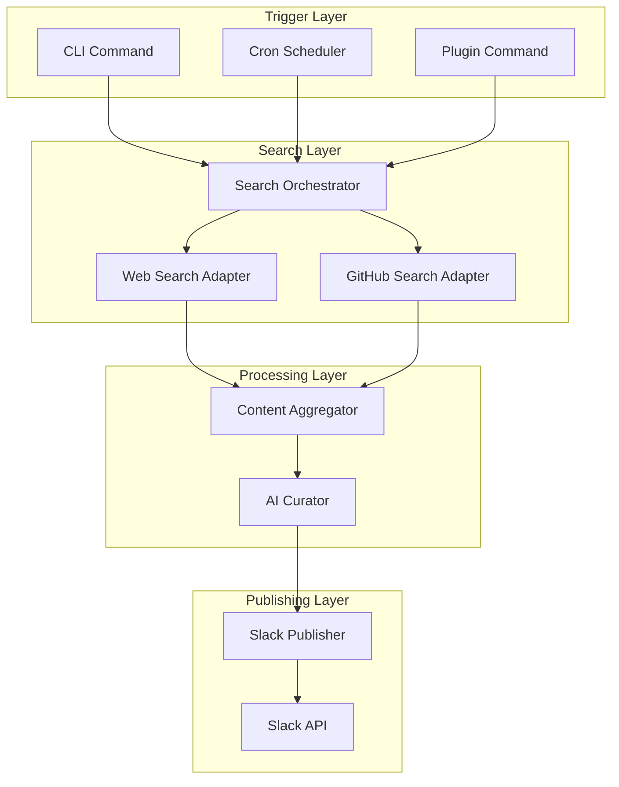

# Search-to-Slack Plugin Architecture & Construction

**Document ID**: 012-AT-ARCH
**Created**: 2025-11-23
**Type**: Architecture Documentation
**Status**: Design Complete
**Version**: 1.0.0

---

## Architecture Overview

The Search-to-Slack plugin implements a pipeline architecture that discovers, curates, and publishes time-series/forecasting content to Slack. This document defines the technical architecture and construction patterns for the MVP implementation.

---

## System Architecture

### High-Level Components



### Component Responsibilities

#### Search Orchestrator
- **Purpose**: Coordinate multiple search sources
- **Responsibilities**:
  - Load search configuration
  - Execute parallel searches
  - Merge results from all sources
  - Apply time range filters
- **Interface**:
  ```python
  class SearchOrchestrator:
      def search(self, topic: Topic) -> List[SearchResult]
  ```

#### Content Aggregator
- **Purpose**: Deduplicate and enrich content
- **Responsibilities**:
  - Normalize URLs
  - Detect duplicate content
  - Merge metadata
  - Sort by relevance/date
- **Interface**:
  ```python
  class ContentAggregator:
      def aggregate(self, results: List[SearchResult]) -> List[Content]
  ```

#### AI Curator
- **Purpose**: Generate summaries and insights
- **Responsibilities**:
  - Call LLM for each content item
  - Parse structured responses
  - Calculate relevance scores
  - Handle API failures gracefully
- **Interface**:
  ```python
  class AICurator:
      def curate(self, content: List[Content]) -> List[CuratedContent]
  ```

#### Slack Publisher
- **Purpose**: Format and publish to Slack
- **Responsibilities**:
  - Build Block Kit messages
  - Handle message size limits
  - Post to configured channel
  - Return message metadata
- **Interface**:
  ```python
  class SlackPublisher:
      def publish(self, items: List[CuratedContent]) -> PublishResult
  ```

---

## Data Models

### Core Types

```python
@dataclass
class SearchResult:
    url: str
    title: str
    description: str
    source: str  # 'web' | 'github'
    timestamp: datetime
    metadata: Dict[str, Any]

@dataclass
class Content:
    url: str
    title: str
    description: str
    source: str
    timestamp: datetime
    duplicate_of: Optional[str]
    metadata: Dict[str, Any]

@dataclass
class CuratedContent:
    content: Content
    summary: str
    key_points: List[str]
    why_it_matters: str
    relevance_score: int  # 0-100

@dataclass
class Topic:
    id: str
    name: str
    keywords: List[str]
    sources: List[str]
    time_range: str  # e.g., "7d", "24h"

@dataclass
class PublishResult:
    success: bool
    channel: str
    timestamp: str
    message_ts: Optional[str]
    error: Optional[str]
```

---

## Search Adapters

### Web Search Adapter (SerpAPI)

```python
class WebSearchAdapter:
    def __init__(self, api_key: str):
        self.api_key = api_key

    def search(self, query: str, time_range: str) -> List[SearchResult]:
        # Implementation details
        # - Build SerpAPI request
        # - Parse organic results
        # - Filter by time range
        # - Return SearchResult objects
```

### GitHub Search Adapter

```python
class GitHubSearchAdapter:
    def __init__(self, token: str, orgs: List[str], repos: List[str]):
        self.token = token
        self.orgs = orgs
        self.repos = repos

    def search(self, query: str, time_range: str) -> List[SearchResult]:
        # Implementation details
        # - Search issues, PRs, releases
        # - Filter by org/repo
        # - Apply time range
        # - Return SearchResult objects
```

---

## Deduplication Strategy

### URL Normalization
1. Convert to lowercase
2. Remove tracking parameters (`utm_*`, `ref=`, etc.)
3. Remove trailing slashes
4. Sort query parameters
5. Remove fragments (#section)

### Title Normalization
1. Convert to lowercase
2. Remove special characters
3. Remove extra whitespace
4. Compare using Levenshtein distance (threshold: 0.9)

### Deduplication Rules
- Exact URL match → duplicate
- Normalized URL match → duplicate
- Title similarity > 0.9 AND same domain → duplicate
- Otherwise → unique

---

## AI Curation Prompt

### System Prompt
```
You are a specialized AI curator for time-series forecasting and Nixtla ecosystem content.
Your task is to summarize technical content for data scientists and ML engineers.
Focus on practical implications and technical insights.
```

### User Prompt Template
```
Analyze this content and provide:
1. A 2-3 sentence summary
2. 2-3 key technical points
3. 1-2 sentences on why this matters for Nixtla/time-series practitioners

Title: {title}
Description: {description}
URL: {url}

Respond in JSON format:
{
  "summary": "...",
  "key_points": ["point1", "point2", "point3"],
  "why_it_matters": "...",
  "relevance_score": 0-100
}
```

---

## Slack Message Construction

### Block Kit Structure

```json
{
  "blocks": [
    {
      "type": "header",
      "text": {
        "type": "plain_text",
        "text": "📊 Nixtla & Time Series Digest"
      }
    },
    {
      "type": "context",
      "elements": [
        {
          "type": "mrkdwn",
          "text": "Generated: Nov 23, 2025 at 9:00 AM PST | Items: 5"
        }
      ]
    },
    {
      "type": "divider"
    },
    {
      "type": "section",
      "text": {
        "type": "mrkdwn",
        "text": "*1. TimeGPT 2.0 Released*\nSource: GitHub • Relevance: 95%"
      }
    },
    {
      "type": "section",
      "text": {
        "type": "mrkdwn",
        "text": "> TimeGPT now supports multivariate forecasting..."
      }
    },
    {
      "type": "section",
      "text": {
        "type": "mrkdwn",
        "text": "*Key Points:*\n• Point 1\n• Point 2\n• Point 3"
      }
    },
    {
      "type": "actions",
      "elements": [
        {
          "type": "button",
          "text": {
            "type": "plain_text",
            "text": "View Source"
          },
          "url": "https://..."
        }
      ]
    }
  ]
}
```

---

## Configuration Schema

### sources.yaml Structure

```yaml
# API Configuration
api_providers:
  serpapi:
    base_url: "https://serpapi.com/search"
    default_params:
      gl: "us"
      hl: "en"
      num: 10

# Source Definitions
sources:
  web:
    provider: serpapi
    max_results: 10
    time_range: 7d
    base_queries:
      - "Nixtla TimeGPT"
      - "StatsForecast MLForecast NeuralForecast"
      - "time series forecasting Python"
    exclude_domains:
      - "pinterest.com"
      - "slideshare.net"

  github:
    api_base: "https://api.github.com"
    organizations:
      - Nixtla
    additional_repos:
      - "facebook/prophet"
      - "amazon/chronos-forecasting"
    content_types:
      - issues
      - pull_requests
      - releases
      - discussions
    max_results: 20
    time_range: 7d
```

### topics.yaml Structure

```yaml
topics:
  nixtla-core:
    name: "Nixtla Core Updates"
    description: "Updates from Nixtla products and ecosystem"
    keywords:
      - TimeGPT
      - StatsForecast
      - MLForecast
      - NeuralForecast
      - hierarchicalforecast
      - datasetsforecast
    sources:
      - web
      - github
    filters:
      min_relevance: 60

  timeseries-trends:
    name: "Time Series Forecasting Trends"
    description: "Broader time series forecasting developments"
    keywords:
      - "time series forecasting"
      - "temporal prediction"
      - "ARIMA alternatives"
      - "deep learning forecasting"
      - "foundation models time series"
    sources:
      - web
    filters:
      min_relevance: 50

  production-ml:
    name: "Production ML for Time Series"
    description: "Deployment and scaling topics"
    keywords:
      - "MLOps time series"
      - "forecasting API"
      - "batch prediction"
      - "real-time forecasting"
    sources:
      - web
      - github
    filters:
      min_relevance: 40
```

---

## Error Handling Strategy

### Graceful Degradation
1. **Search Failures**: Log error, continue with other sources
2. **LLM Failures**: Use fallback summary from description
3. **Slack Failures**: Retry with exponential backoff
4. **Config Errors**: Fail fast with clear error message

### Retry Logic
```python
def with_retry(func, max_attempts=3, backoff_factor=2):
    for attempt in range(max_attempts):
        try:
            return func()
        except Exception as e:
            if attempt == max_attempts - 1:
                raise
            time.sleep(backoff_factor ** attempt)
```

### Logging Strategy
- **INFO**: Normal operations (searches, publications)
- **WARNING**: Recoverable errors (retries, fallbacks)
- **ERROR**: Failures requiring attention
- **DEBUG**: Detailed traces for development

---

## Performance Considerations

### Optimization Points
1. **Parallel Searches**: Use concurrent.futures for parallel API calls
2. **Caching**: Cache search results for 1 hour (development only)
3. **Batch LLM Calls**: Future optimization (not MVP)
4. **Rate Limiting**: Respect API rate limits with backoff

### Resource Limits
- **Memory**: Target < 500MB
- **Execution Time**: Target < 60 seconds
- **API Calls**: Max 50 per run
- **LLM Tokens**: ~500 per item

---

## Security Considerations

### Secret Management
- **Environment Variables**: All secrets in env vars
- **No Hardcoding**: Zero secrets in code
- **Validation**: Verify all required secrets on startup
- **Rotation**: Document rotation procedures

### API Security
- **HTTPS Only**: All API calls over HTTPS
- **Token Scope**: Minimal permissions for each service
- **Error Messages**: Never expose secrets in logs
- **Input Validation**: Sanitize all user inputs

---

## Testing Strategy

### Unit Tests
- Mock all external services
- Test each component in isolation
- Coverage target: 80%
- Use pytest fixtures

### Integration Tests
- Test component interactions
- Use recorded responses (VCR.py)
- Verify data flow end-to-end
- Test error scenarios

### Manual Testing
- Test with real APIs (limited)
- Verify Slack formatting
- Check rate limiting behavior
- Validate configuration loading

---

## Deployment Patterns

### Local Development
```bash
# Setup
python -m venv venv
source venv/bin/activate
pip install -e .

# Run
python -m nixtla_search_to_slack --topic nixtla-core
```

### Cron Deployment
```cron
# Daily at 9 AM
0 9 * * * /path/to/venv/bin/python -m nixtla_search_to_slack --topic nixtla-core
```

### GitHub Actions (Template)
```yaml
name: Daily Digest
on:
  schedule:
    - cron: '0 14 * * *'  # 2 PM UTC
jobs:
  digest:
    runs-on: ubuntu-latest
    steps:
      - uses: actions/checkout@v3
      - run: pip install -e plugins/nixtla-search-to-slack
      - run: python -m nixtla_search_to_slack --topic nixtla-core
        env:
          SLACK_BOT_TOKEN: ${{ secrets.SLACK_BOT_TOKEN }}
          # ... other secrets
```

---

## Monitoring & Observability (Future)

### Metrics to Track
- Search result counts by source
- Deduplication effectiveness
- LLM token usage
- Slack post success rate
- End-to-end latency

### Alerting Conditions
- No results found
- All API calls failing
- Cost threshold exceeded
- Slack rate limited

---

## Migration Path to Production

### Phase 1 → Phase 2
1. Add database for persistence
2. Implement advanced deduplication
3. Add more content sources
4. Build admin UI

### Phase 2 → Phase 3
1. Move to queue-based architecture
2. Add monitoring infrastructure
3. Implement multi-channel support
4. Add user preferences

### Phase 3 → Phase 4
1. Deploy ML models for ranking
2. Add recommendation engine
3. Implement feedback loop
4. Scale to multiple organizations

---

## Appendix: Example Code Snippets

### Simple Search Orchestrator
```python
class SearchOrchestrator:
    def __init__(self, config: Dict[str, Any]):
        self.config = config
        self.adapters = self._init_adapters()

    def search(self, topic: Topic) -> List[SearchResult]:
        results = []
        for source in topic.sources:
            if source in self.adapters:
                adapter_results = self.adapters[source].search(
                    query=" OR ".join(topic.keywords),
                    time_range=topic.time_range
                )
                results.extend(adapter_results)
        return results
```

### Basic Deduplication
```python
def normalize_url(url: str) -> str:
    parsed = urlparse(url.lower())
    # Remove tracking params
    params = parse_qs(parsed.query)
    clean_params = {
        k: v for k, v in params.items()
        if not k.startswith('utm_')
    }
    # Rebuild URL
    clean_query = urlencode(clean_params, doseq=True)
    return f"{parsed.scheme}://{parsed.netloc}{parsed.path}?{clean_query}"
```

---

**Document Status**: This architecture document defines the construction patterns for the Search-to-Slack MVP plugin. Implementation should follow these patterns while maintaining flexibility for future enhancements.

---

**Created**: 2025-11-23
**Last Updated**: 2025-11-23