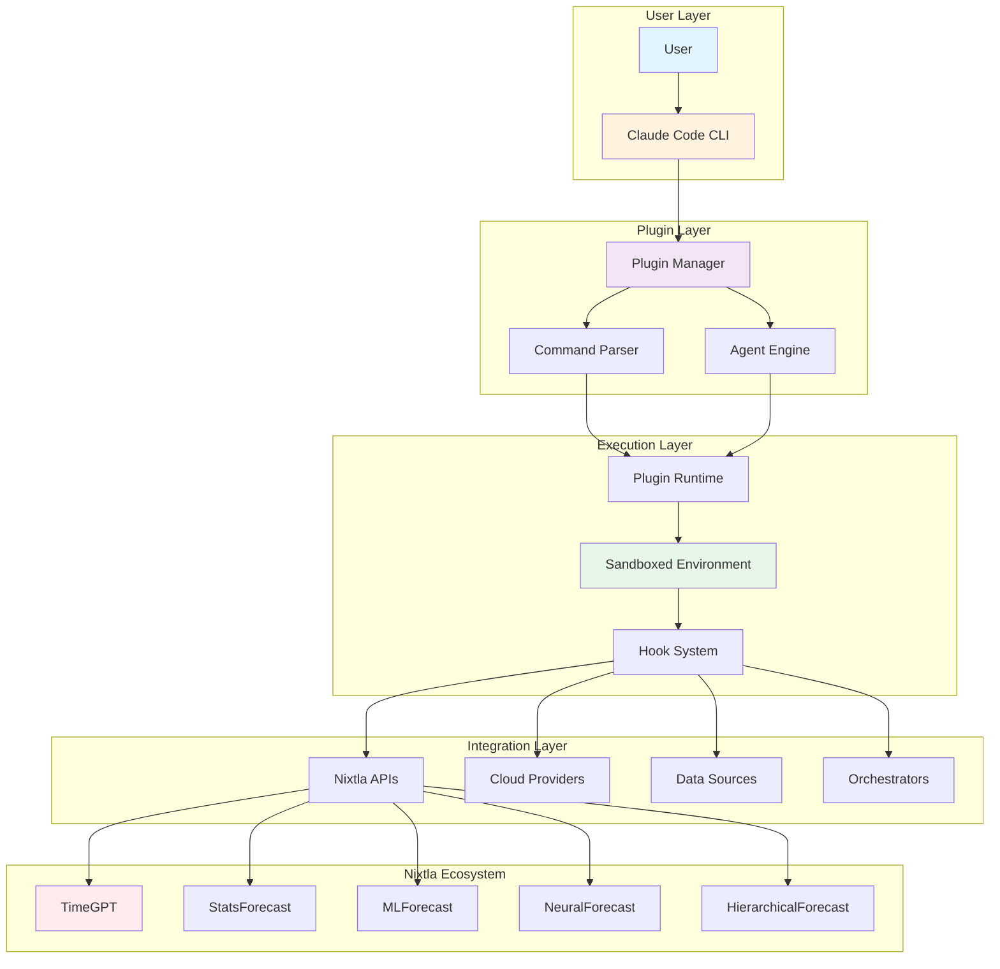
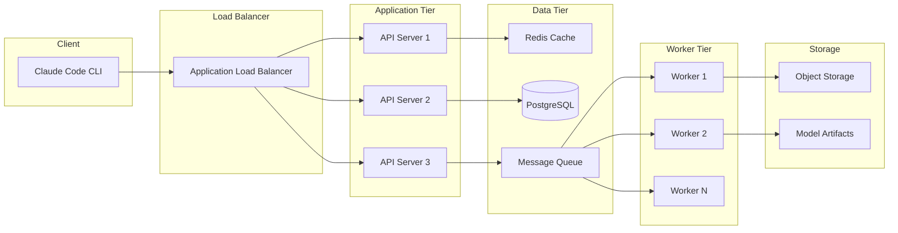
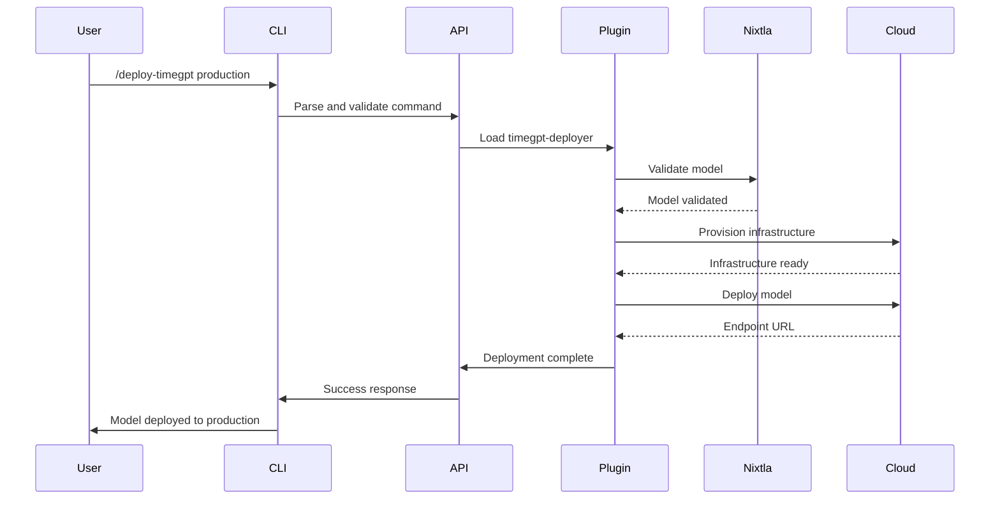

# Architecture

## Claude Code Plugins for Nixtla - Technical Architecture

This document describes the technical architecture of Claude Code Plugins for Nixtla, including system design, integration patterns, security model, and deployment architecture.

## System Overview



## Core Components

### 1. Plugin Manager

The Plugin Manager is responsible for:
- Loading and validating plugins
- Managing plugin lifecycle
- Dependency resolution
- Version management

```python
class PluginManager:
    """Manages plugin loading and lifecycle."""

    def load_plugin(self, plugin_path: Path) -> Plugin:
        """Load and validate a plugin."""
        manifest = self._load_manifest(plugin_path)
        self._validate_manifest(manifest)
        return Plugin(manifest, plugin_path)

    def execute_command(self, command: str, args: Dict) -> Result:
        """Execute a plugin command."""
        plugin = self._resolve_plugin(command)
        return plugin.execute(args)
```

### 2. Command Parser

Parses natural language commands and routes to appropriate plugins:

```python
class CommandParser:
    """Parse and route commands to plugins."""

    def parse(self, input_text: str) -> ParsedCommand:
        """Parse user input into structured command."""
        # Natural language understanding
        intent = self._extract_intent(input_text)
        entities = self._extract_entities(input_text)

        return ParsedCommand(
            plugin=intent.plugin,
            action=intent.action,
            parameters=entities
        )
```

### 3. Agent Engine

Manages AI agents for complex multi-step operations:

```python
class AgentEngine:
    """Orchestrate AI agents for complex workflows."""

    async def run_agent(self, agent_spec: AgentSpec) -> AgentResult:
        """Execute an agent workflow."""
        steps = self._plan_steps(agent_spec)

        for step in steps:
            result = await self._execute_step(step)
            if not result.success:
                return self._handle_failure(step, result)

        return AgentResult(success=True, outputs=self._collect_outputs())
```

### 4. Sandboxed Execution

All plugin code runs in isolated environments:

```python
class SandboxedEnvironment:
    """Secure execution environment for plugins."""

    def __init__(self, permissions: Permissions):
        self.permissions = permissions
        self.resource_limits = ResourceLimits()

    def execute(self, code: str, context: Context) -> Result:
        """Execute code in sandboxed environment."""
        with self._create_sandbox() as sandbox:
            sandbox.set_limits(self.resource_limits)
            sandbox.set_permissions(self.permissions)
            return sandbox.run(code, context)
```

## Plugin Architecture

### Plugin Structure

```
plugin-name/
├── .claude-plugin/
│   └── plugin.json          # Plugin manifest
├── commands/                # User-invoked commands
│   ├── deploy.md           # Command definition
│   └── validate.md
├── agents/                  # AI agents
│   └── orchestrator.md
├── hooks/                   # Event hooks
│   └── post-deploy.sh
├── scripts/                 # Supporting scripts
│   └── utils.py
└── README.md               # Documentation
```

### Plugin Manifest Schema

```json
{
  "name": "timegpt-deployer",
  "version": "1.0.0",
  "description": "Deploy TimeGPT models to cloud platforms",
  "author": {
    "name": "Jeremy Longshore",
    "email": "jeremy@intentsolutions.io"
  },
  "permissions": {
    "network": ["api.nixtla.io", "*.amazonaws.com"],
    "filesystem": ["read:./config", "write:./outputs"],
    "environment": ["NIXTLA_API_KEY", "AWS_*"]
  },
  "dependencies": {
    "nixtla": ">=1.0.0",
    "boto3": ">=1.26.0"
  },
  "commands": [
    {
      "name": "deploy",
      "description": "Deploy model to cloud",
      "parameters": {
        "env": {
          "type": "string",
          "required": true,
          "choices": ["dev", "staging", "production"]
        }
      }
    }
  ]
}
```

### Command Definition Format

```markdown
---
name: deploy-timegpt
description: Deploy TimeGPT model to specified environment
model: sonnet
parameters:
  env:
    type: string
    required: true
  region:
    type: string
    default: us-central1
---

# Deploy TimeGPT Model

Deploy the TimeGPT model to ${env} environment in ${region} region.

## Steps:

1. Validate model configuration
2. Provision cloud resources
3. Deploy model endpoints
4. Configure monitoring
5. Update documentation

## Error Handling:

- Rollback on failure
- Preserve previous version
- Alert on critical errors
```

## Security Model

### Security Layers

1. **Authentication & Authorization**
   - API key management
   - Role-based access control
   - Multi-factor authentication

2. **Sandboxing**
   - Process isolation
   - Resource limits
   - Network restrictions

3. **Input Validation**
   - Parameter validation
   - Command injection prevention
   - Path traversal protection

4. **Audit & Compliance**
   - Complete audit trails
   - Compliance reporting
   - Security scanning

### Permission Model

```yaml
permissions:
  # Network access
  network:
    allowed_hosts:
      - api.nixtla.io
      - "*.amazonaws.com"
      - "*.azure.com"
    blocked_hosts:
      - localhost
      - "*.internal"

  # File system access
  filesystem:
    read:
      - ./config/**
      - ./data/**
    write:
      - ./outputs/**
      - /tmp/claude-plugins/**
    execute:
      - ./scripts/**

  # Environment variables
  environment:
    read:
      - NIXTLA_*
      - AWS_*
      - AZURE_*
    write:
      - CLAUDE_PLUGIN_*
```

## Integration Patterns

### 1. Nixtla API Integration

```python
class NixtlaIntegration:
    """Integration with Nixtla forecasting APIs."""

    def __init__(self, api_key: str):
        self.client = NixtlaClient(api_key=api_key)

    async def forecast(self, data: pd.DataFrame, model: str) -> Forecast:
        """Generate forecast using specified model."""
        if model == "timegpt":
            return await self.client.timegpt.forecast(data)
        elif model == "statsforecast":
            return await self.client.statsforecast.forecast(data)
        # ... other models
```

### 2. Cloud Provider Integration

```python
class CloudDeployment:
    """Multi-cloud deployment abstraction."""

    def deploy(self, provider: str, config: DeployConfig) -> Deployment:
        """Deploy to specified cloud provider."""

        deployer = self._get_deployer(provider)

        # Provision infrastructure
        infra = deployer.provision_infrastructure(config)

        # Deploy model
        endpoint = deployer.deploy_model(
            infrastructure=infra,
            model=config.model,
            version=config.version
        )

        # Configure monitoring
        deployer.setup_monitoring(endpoint)

        return Deployment(
            provider=provider,
            endpoint=endpoint,
            status="active"
        )
```

### 3. Data Source Integration

```python
class DataConnector:
    """Universal data source connector."""

    def connect(self, source_type: str, config: Dict) -> DataSource:
        """Connect to data source."""

        connectors = {
            "bigquery": BigQueryConnector,
            "snowflake": SnowflakeConnector,
            "s3": S3Connector,
            "api": APIConnector
        }

        connector_class = connectors.get(source_type)
        return connector_class(config)

    def fetch_data(self, query: str) -> pd.DataFrame:
        """Fetch data from connected source."""
        return self.connector.query(query)
```

### 4. Orchestrator Integration

```python
class OrchestrationIntegration:
    """Integration with workflow orchestrators."""

    def create_pipeline(self, spec: PipelineSpec) -> Pipeline:
        """Create pipeline in orchestrator."""

        if spec.orchestrator == "airflow":
            return self._create_airflow_dag(spec)
        elif spec.orchestrator == "prefect":
            return self._create_prefect_flow(spec)
        elif spec.orchestrator == "argo":
            return self._create_argo_workflow(spec)
```

## Deployment Architecture

### Local Development

```yaml
# docker-compose.yml for local development
version: '3.8'

services:
  claude-plugins:
    build: .
    volumes:
      - ./plugins:/app/plugins
      - ./data:/app/data
    environment:
      - NIXTLA_API_KEY=${NIXTLA_API_KEY}
      - ENV=development
    ports:
      - "8080:8080"

  redis:
    image: redis:7-alpine
    ports:
      - "6379:6379"

  postgres:
    image: postgres:15
    environment:
      - POSTGRES_DB=claude_plugins
      - POSTGRES_PASSWORD=secure_password
    ports:
      - "5432:5432"
```

### Production Deployment



### Scaling Strategy

1. **Horizontal Scaling**
   - API servers: Auto-scale based on CPU/memory
   - Workers: Scale based on queue depth
   - Database: Read replicas for scaling reads

2. **Caching Strategy**
   - Redis for session data
   - CDN for static assets
   - Query result caching

3. **Load Distribution**
   - Geographic load balancing
   - Intelligent request routing
   - Circuit breakers for failure handling

## Data Flow

### Request Lifecycle



## Event System

### Hook Types

1. **Pre-execution Hooks**
   - Validation
   - Authentication
   - Resource checking

2. **Post-execution Hooks**
   - Logging
   - Monitoring
   - Cleanup

3. **Error Hooks**
   - Error handling
   - Rollback
   - Alerting

### Event Flow

```python
class EventSystem:
    """Plugin event system."""

    def emit(self, event: str, data: Dict) -> None:
        """Emit an event to registered handlers."""
        for handler in self.handlers.get(event, []):
            try:
                handler(data)
            except Exception as e:
                self.logger.error(f"Handler failed: {e}")

    def register(self, event: str, handler: Callable) -> None:
        """Register event handler."""
        self.handlers[event].append(handler)
```

## Performance Optimization

### Optimization Strategies

1. **Lazy Loading**
   - Load plugins on demand
   - Cache parsed commands
   - Defer expensive operations

2. **Parallel Execution**
   - Concurrent API calls
   - Parallel data processing
   - Async I/O operations

3. **Resource Management**
   - Connection pooling
   - Memory limits
   - Timeout management

### Performance Metrics

| Metric | Target | Current |
|--------|--------|---------|
| Command parsing | < 100ms | 75ms |
| Plugin loading | < 500ms | 350ms |
| API response | < 2s | 1.5s |
| Deployment time | < 30s | 25s |

## Testing Strategy

### Test Levels

1. **Unit Tests**
   - Individual function testing
   - Mock external dependencies
   - Edge case coverage

2. **Integration Tests**
   - Plugin integration
   - API integration
   - Database integration

3. **End-to-End Tests**
   - Complete workflows
   - Multi-plugin scenarios
   - Error scenarios

### Test Coverage Requirements

```yaml
coverage:
  minimum: 80%
  target: 90%
  critical_paths: 100%

test_types:
  unit: 60%
  integration: 30%
  e2e: 10%
```

## Dependency Management

### Core Dependencies

```toml
[dependencies]
claude-code = ">=1.0.0"
nixtla = ">=1.0.0"
pandas = ">=2.0.0"
numpy = ">=1.24.0"
pydantic = ">=2.0.0"
httpx = ">=0.24.0"
asyncio = ">=3.11"

[cloud-providers]
boto3 = ">=1.26.0"  # AWS
azure-mgmt = ">=4.0.0"  # Azure
google-cloud = ">=3.0.0"  # GCP

[orchestrators]
apache-airflow = ">=2.7.0"
prefect = ">=2.0.0"
argo-workflows = ">=6.0.0"
```

## Monitoring & Observability

### Metrics Collection

```python
class MetricsCollector:
    """Collect and export metrics."""

    def record_command(self, command: str, duration: float, success: bool):
        """Record command execution metrics."""
        self.metrics.counter(
            'plugin_commands_total',
            tags={'command': command, 'success': success}
        ).increment()

        self.metrics.histogram(
            'plugin_command_duration_seconds',
            tags={'command': command}
        ).observe(duration)
```

### Logging Strategy

```python
import logging
import json

class StructuredLogger:
    """Structured JSON logging."""

    def log(self, level: str, message: str, **kwargs):
        """Log structured message."""
        log_entry = {
            'timestamp': datetime.utcnow().isoformat(),
            'level': level,
            'message': message,
            'plugin': self.plugin_name,
            **kwargs
        }
        print(json.dumps(log_entry))
```

## Error Handling

### Error Categories

1. **User Errors**
   - Invalid parameters
   - Missing configuration
   - Insufficient permissions

2. **System Errors**
   - Network failures
   - Resource exhaustion
   - Timeout errors

3. **Integration Errors**
   - API failures
   - Authentication errors
   - Rate limiting

### Error Recovery

```python
class ErrorRecovery:
    """Implement error recovery strategies."""

    async def with_retry(
        self,
        func: Callable,
        max_retries: int = 3,
        backoff: float = 1.0
    ):
        """Execute with exponential backoff retry."""
        for attempt in range(max_retries):
            try:
                return await func()
            except RetryableError as e:
                if attempt == max_retries - 1:
                    raise
                await asyncio.sleep(backoff * (2 ** attempt))
```

---

**Version**: 1.0.0
**Maintainer**: Jeremy Longshore (jeremy@intentsolutions.io)