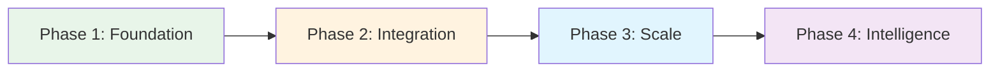

# Roadmap

## Claude Code Plugins for Nixtla - Development Roadmap

This roadmap outlines potential development directions for Claude Code Plugins that could support Nixtla's time series ecosystem. These are initial ideas and exploration areas subject to refinement based on feasibility and priorities.

## Vision

Explore ways to simplify time series forecasting workflows through natural language commands, potentially reducing the time and complexity involved in deploying forecasting models.

## Development Timeline

## Proposed Development Phases

### Phase 1: Foundation

**Proposed Goal:** Establish basic plugin architecture and explore initial functionality

#### Potential Deliverables:

1. **Repository & Documentation**
   - Complete repository structure
   - Comprehensive documentation
   - Example implementations
   - Contributing guidelines

2. **Core Plugin Architecture**
   - Plugin loading system
   - Command parser
   - Agent framework
   - Security model

3. **TimeGPT Deployer Plugin**
   - `/deploy-timegpt` command
   - Multi-cloud support (AWS, Azure, GCP)
   - Rollback capabilities
   - Status monitoring

4. **Forecast Validator Plugin**
   - Cross-model validation
   - Statistical metrics
   - Visual comparisons
   - Performance benchmarks

#### Potential Success Indicators:
- [ ] 2 production-ready plugins
- [ ] < 30 second deployment time
- [ ] 95% test coverage
- [ ] Complete documentation

### Phase 2: Integration

**Potential Focus:** Explore integrations with existing data pipelines and workflow tools

#### Potential Deliverables:

1. **Pipeline Engine Plugin**
   - Natural language pipeline creation
   - DAG generation
   - Dependency management
   - Error handling

2. **Model Analyzer Plugin**
   - Performance metrics
   - Drift detection
   - Feature importance
   - Model comparison

3. **Data Connector Plugin**
   - 10+ data source integrations
   - Real-time streaming support
   - Data validation
   - Schema management

4. **Workflow Integration**
   - Airflow DAG generation
   - Prefect flow creation
   - Kubernetes jobs
   - Scheduling automation

#### Potential Success Indicators:
- [ ] 5+ active plugins
- [ ] 10+ data source connectors
- [ ] < 5 minute pipeline setup
- [ ] 50+ active users

### Phase 3: Scale

**Possible Direction:** Consider enterprise features and scaling approaches

#### Potential Deliverables:

1. **Multi-region Deployment**
   - Geographic distribution
   - Latency optimization
   - Failover automation
   - Cost optimization

2. **Advanced AutoML**
   - Automated model selection
   - Feature engineering
   - Ensemble methods
   - Neural architecture search

3. **Custom Metrics Framework**
   - Business-specific KPIs
   - Custom scoring functions
   - A/B testing support
   - Experiment tracking

4. **Enterprise Security**
   - Single Sign-On (SSO)
   - Role-based access control
   - Audit logging
   - Compliance certifications

#### Potential Success Indicators:
- [ ] 3+ cloud provider support
- [ ] < 100ms latency globally
- [ ] SOC2 compliance ready
- [ ] 100+ active users

### Phase 4: Intelligence

**Exploration Area:** Research AI-assisted optimization possibilities

#### Potential Deliverables:

1. **AI Optimization Advisor**
   - Performance recommendations
   - Cost optimization suggestions
   - Architecture improvements
   - Best practice enforcement

2. **Automated Tuning**
   - Hyperparameter optimization
   - Resource allocation
   - Batch size optimization
   - Training schedule optimization

3. **Anomaly Detection**
   - Real-time monitoring
   - Intelligent alerting
   - Root cause analysis
   - Auto-remediation

4. **Natural Language Reporting**
   - Executive summaries
   - Technical deep-dives
   - Custom report generation
   - Stakeholder-specific views

#### Potential Success Indicators:
- [ ] 20% performance improvement via AI recommendations
- [ ] 50% reduction in manual tuning time
- [ ] < 1 minute anomaly detection
- [ ] 200+ active users

## Future Vision

### Long-term Vision:
- **Autonomous Forecasting**: Fully automated end-to-end forecasting systems
- **Cross-platform Integration**: Support for all major ML platforms
- **Industry Solutions**: Vertical-specific plugins for retail, finance, manufacturing
- **Global Marketplace**: Community plugin ecosystem

### Long-term Possibilities:
- Develop useful workflow automation tools
- Build a sustainable user community
- Encourage plugin contributions
- Support common data source integrations

## Potential Performance Indicators

### Technical Targets (To Be Validated):
- Reasonable plugin execution times
- High reliability when achievable
- Solid test coverage where practical
- Clear documentation

### Adoption Goals (Exploratory):
- Build active user base gradually
- Encourage community participation
- Gather feedback for improvements
- Maintain user satisfaction

### Quality Objectives:
- Responsive bug resolution
- Security-conscious development
- Timely code reviews
- Stable releases when possible

## Release Cycle

### Release Schedule:
- **Major releases**: Quarterly (v1.0, v2.0, v3.0, v4.0)
- **Minor releases**: Monthly (v1.1, v1.2, etc.)
- **Patch releases**: As needed for critical fixes

### Release Process:
1. Feature freeze: 2 weeks before release
2. Testing phase: 1 week
3. Documentation update: 3 days
4. Release candidate: 2 days before release
5. Production release: First Tuesday of the month

## Community Involvement

### How to Contribute:
- **Feature Requests**: Open an issue with the `enhancement` label
- **Bug Reports**: Use the bug report template
- **Plugin Proposals**: Submit via plugin proposal template
- **Code Contributions**: See [CONTRIBUTING.md](./CONTRIBUTING.md)

### Priority Input Areas:
- Use case examples from production
- Performance optimization ideas
- Integration requirements
- UI/UX feedback

## Progress Tracking

### Where to Track Progress:
- **GitHub Project Board**: [Project Board](https://github.com/jeremylongshore/claude-code-plugins-nixtla/projects)
- **Milestones**: [GitHub Milestones](https://github.com/jeremylongshore/claude-code-plugins-nixtla/milestones)
- **Release Notes**: [Releases](https://github.com/jeremylongshore/claude-code-plugins-nixtla/releases)

### Status Updates:
- Monthly progress reports in Discussions
- Quarterly review meetings (open to community)
- Annual roadmap revision

## Risk Management

### Identified Risks:
1. **Technical Debt**: Mitigated by regular refactoring sprints
2. **Dependency Updates**: Automated security scanning and updates
3. **Scaling Issues**: Load testing and gradual rollout
4. **User Adoption**: Focus on documentation and examples

### Contingency Plans:
- Feature delays: Communicate early and adjust scope
- Critical bugs: Hotfix process with 24-hour turnaround
- Resource constraints: Community collaboration and open-source model

## Contact

**Questions about the roadmap?**
- Email: jeremy@intentsolutions.io
- Cell: 251.213.1115
- GitHub Discussions: [Roadmap Discussion](https://github.com/jeremylongshore/claude-code-plugins-nixtla/discussions)

---

**Version**: 1.0.0
**Status**: Active Development

*This is a living document. We'll update it based on feedback, feasibility assessments, and evolving priorities.*