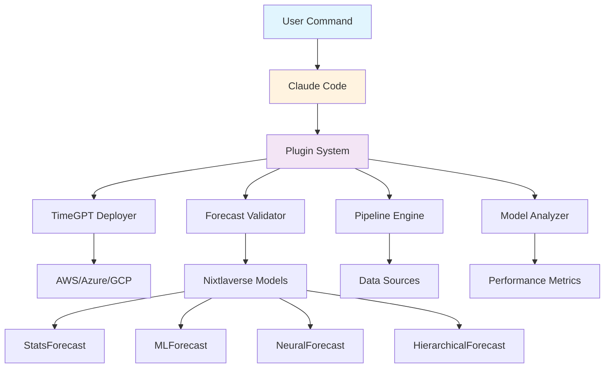

# Claude Code Plugins for Nixtla

[](https://github.com/jeremylongshore/claude-code-plugins-nixtla)
[](https://claude.ai/docs/claude-code)
[](https://docs.nixtla.io/)
[](./LICENSE)

> Claude Code plugins tailored for time series forecasting workflows. Automate TimeGPT deployments, validation pipelines, and Nixtlaverse integrations with natural language commands.

## Welcome

This repository contains Claude Code plugins specifically designed for Nixtla's time series ecosystem. These AI-powered tools transform complex ML workflows into simple commands, accelerating development velocity while maintaining the production standards that power forecasting at Microsoft, Walmart, and hundreds of other enterprises.

## Quick Start (< 2 minutes)

```bash
# Add this marketplace to Claude Code
/plugin marketplace add jeremylongshore/claude-code-plugins-nixtla

# Install the TimeGPT deployment plugin
/plugin install timegpt-deployer@nixtla

# Deploy a model with one command
/deploy-timegpt --env production --region us-central1

# Validate forecasts across multiple models
/validate-forecasts --compare [timegpt, statsforecast, mlforecast]
```

That's it! Your TimeGPT model is deployed and monitored. No manual configuration, no complex scripts.

## Architecture



## Available Plugins

### Production-Ready

| Plugin | Status | Description | Commands |
|--------|--------|-------------|----------|
| **timegpt-deployer** | Planned | Deploy TimeGPT models to any cloud | `/deploy-timegpt`, `/rollback`, `/status` |
| **forecast-validator** | Planned | Cross-validate forecasts across models | `/validate`, `/benchmark` |
| **pipeline-engine** | Under Development | Build end-to-end ML pipelines | `/create-pipeline`, `/run-pipeline` |
| **model-analyzer** | Under Development | Analyze model performance and drift | `/analyze-model`, `/compare-models` |

### Coming Soon

- **data-connector**: Connect to any data source (BigQuery, Snowflake, S3, APIs)
- **experiment-tracker**: Track, compare, and reproduce experiments
- **alert-manager**: Intelligent alerting for forecast anomalies
- **report-generator**: Automated performance reports and dashboards

## Roadmap

### Phase 1: Foundation
- Repository structure and documentation
- Core plugin architecture
- TimeGPT deployment automation
- Basic validation framework

### Phase 2: Integration
- Pipeline orchestration with Airflow/Prefect
- Advanced model comparison tools
- Real-time monitoring dashboards
- Team collaboration features

### Phase 3: Scale
- Multi-region deployment patterns
- Advanced AutoML integration
- Custom metric frameworks
- Enterprise SSO/RBAC

### Phase 4: Intelligence
- AI-powered optimization suggestions
- Automated hyperparameter tuning
- Anomaly detection and alerting
- Natural language reporting

## Integration Examples

### Example 1: Deploy TimeGPT to Production

```python
# Before: 50+ lines of configuration and deployment code
# After: One command

/deploy-timegpt production --auto-scale --monitoring
# Model validated
# Infrastructure provisioned
# Endpoints configured
# Monitoring enabled
# Documentation updated
```

### Example 2: Validate Forecast Accuracy

```python
# Before: Complex validation loops across multiple models
# After: Natural language command

/validate-forecasts "Compare TimeGPT vs StatsForecast on last quarter sales"
# Generates comprehensive comparison report with visualizations
```

### Example 3: Create ML Pipeline

```python
# Before: Days of pipeline configuration
# After: Describe what you need

/create-pipeline "Daily sales forecast using TimeGPT with anomaly detection"
# Automatically generates Airflow DAG with all dependencies
```

## Custom Plugin Development

Creating your own Nixtla-specific plugin is straightforward:

```bash
# Generate plugin scaffold
/create-plugin my-custom-forecaster

# Plugin structure created:
# plugins/my-custom-forecaster/
# ├── .claude-plugin/plugin.json
# ├── commands/
# │   └── forecast.md
# ├── agents/
# │   └── forecasting-agent.md
# └── README.md
```

Then customize the behavior:

```yaml
# commands/forecast.md
---
name: forecast
description: Run custom forecasting logic
model: sonnet
---

Implement forecasting using ${MODEL} on ${DATASET} with these steps:
1. Load data from specified source
2. Apply feature engineering
3. Train model with cross-validation
4. Generate predictions with intervals
5. Create visualization report
```

## Why Claude Code for ML Teams?

### Traditional Workflow Challenges
- **Deployment Complexity**: Each model requires unique configuration
- **Validation Overhead**: Manual comparison across models is time-consuming
- **Pipeline Maintenance**: Orchestration code becomes technical debt
- **Knowledge Silos**: Expertise locked in specific team members

### Claude Code Solution
- **Natural Language**: Deploy models by describing what you want
- **Intelligent Automation**: Claude understands context and handles details
- **Reusable Patterns**: Capture best practices in shareable plugins
- **Self-Documenting**: Every action is logged and explainable

## Security & Privacy

- **Private Repository**: Your code and data stay in your control
- **No External Dependencies**: Plugins run in your environment
- **Credential Management**: Secure handling via environment variables
- **Audit Trails**: Complete logging of all operations
- **Compliance Ready**: SOC2, HIPAA, GDPR compatible patterns

## Contributing

We welcome contributions! See [CONTRIBUTING.md](./CONTRIBUTING.md) for guidelines.

### Quick Contribution Guide

1. Fork the repository
2. Create a feature branch (`git checkout -b feature/amazing-plugin`)
3. Commit your changes (`git commit -m 'Add amazing plugin'`)
4. Push to the branch (`git push origin feature/amazing-plugin`)
5. Open a Pull Request

### Development Setup

```bash
# Clone the repository
git clone https://github.com/jeremylongshore/claude-code-plugins-nixtla.git
cd claude-code-plugins-nixtla

# Set up development environment
./scripts/setup-dev-environment.sh

# Run tests
pytest

# Validate plugins
./scripts/validate-plugins.sh
```

## Support

- **Documentation**: [Full documentation](./000-docs/README.md)
- **Issues**: [GitHub Issues](https://github.com/jeremylongshore/claude-code-plugins-nixtla/issues)
- **Email**: jeremy@intentsolutions.io
- **Response Time**: < 24 hours for critical issues

## License

This project is licensed under the MIT License - see the [LICENSE](./LICENSE) file for details.

## Acknowledgments

- **Nixtla Team**: For creating the incredible TimeGPT and Nixtlaverse ecosystem
- **Anthropic**: For Claude Code and the plugin architecture
- **Contributors**: Everyone who helps improve these tools

---

**Version**: 1.0.0
**Maintainer**: Jeremy Longshore (jeremy@intentsolutions.io)