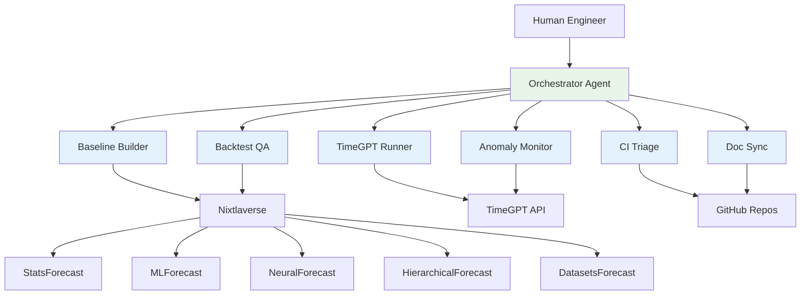

# Nixtla Agentic Engineering Workspace (Private)

> A Bob-style multi-agent system that wraps Nixtla's time series stack to prototype 'junior engineer' agents for internal use.

[](https://github.com/jeremylongshore/claude-code-plugins-nixtla)
[]()
[](https://docs.nixtla.io/)
[](./LICENSE)

> **Status**: Experimental | Private collaboration workspace between Jeremy Longshore (Intent Solutions) and Max Mergenthaler (Nixtla)

## Overview

This is a **private, experimental workspace** for prototyping an agentic system built on Claude + tools that understands Nixtla's time series workflows and can take on repetitive engineering work.

The system is intentionally modeled after **Bob's Brain** (foreman + specialist agents, CI-only deploys, strict guardrails) but re-skinned for the Nixtla ecosystem. Rather than managing ADK deployments, these agents handle time-series forecasting workflows, model benchmarking, CI triage, and documentation sync across Nixtla's libraries.

The goal is to build a "junior engineer agent crew" that wraps around Nixtla's existing tooling—not to replace it, but to automate the repetitive parts while senior engineers focus on research, new models, and strategic decisions.

## Nixtla Context

Nixtla already has a sophisticated, modern time-series forecasting stack:

**Nixtlaverse Libraries**:
- **StatsForecast**: Classical statistical methods (ARIMA, ETS, etc.)
- **MLForecast**: Machine learning forecasting (LightGBM, XGBoost, etc.)
- **NeuralForecast**: Deep learning models (NHITS, NBEATS, TFT, etc.)
- **HierarchicalForecast**: Hierarchical reconciliation methods
- **DatasetsForecast**: Benchmark datasets and evaluation utilities

**TimeGPT / Enterprise Engine**:
- Foundation model for time-series forecasting
- Anomaly detection and monitoring
- Integration with existing data infrastructure (Snowflake, GCP, AWS, Azure, on-prem)
- BI tool connectivity

This agent system is **designed to plug into these repos, APIs, and workflows**—not to create a parallel universe. The agents handle repetitive tasks and boilerplate so human engineers can focus on high-value work.

## Agentic System: "Bob for Nixtla"

### Architecture

The system follows Bob's Brain's proven pattern:
- **One orchestrator agent** that understands Nixtla-flavored engineering jobs
- **Multiple specialist agents** that handle specific tasks
- **Human-in-the-loop review** for all code changes
- **CI-only deployments** with strict guardrails
- **Golden tasks** and ARV-style validation

### Specialist Agents

**1. Baseline Builder**
- Creates baseline forecasts using StatsForecast / MLForecast / NeuralForecast
- Generates notebooks with metrics tables
- Works on internal or public datasets
- Standardizes evaluation methodology

**2. Backtest & Benchmark QA**
- Runs standardized backtests on benchmark datasets
- Uses Nixtla's `datasetsforecast` + existing tutorials
- Compares model performance across approaches
- Summarizes results with statistical significance

**3. TimeGPT Experiment Runner**
- Spins up TimeGPT experiments with different configs
- Tracks parameters and results
- Stores experiment artifacts
- Generates comparison reports

**4. CI & Test Triage**
- Parses CI logs from Nixtla repositories
- Identifies likely root causes of failures
- Proposes fixes or comments on PRs
- Reduces time-to-fix for common issues

**5. Docs & Examples Sync**
- Detects drift between code and documentation
- Finds outdated notebooks and examples
- Drafts PRs to update docs after API changes
- Maintains consistency across tutorials

**6. Anomaly Monitor**
- Leverages TimeGPT and Nixtla methods
- Detects anomalies in key time series
- Proposes follow-up actions
- Monitors production pipeline health

These agents aim to **automate repetitive engineering tasks** while keeping humans in the loop for strategy, research, and complex decision-making.

## Architecture & Principles

Inspired by Bob's Brain, this system follows these principles:

**Orchestrator + Specialist Pattern**:
- Central orchestrator delegates to domain-specific agents
- Each specialist has deep knowledge of one workflow
- Agents communicate through structured interfaces

**Strict Guardrails & Testing**:
- Golden tasks validate agent behavior
- ARV-style checks before any deployment
- CI-only deployments, never direct to prod
- Comprehensive test coverage

**GitHub Integration**:
- Reading repos and understanding codebases
- Opening PRs with proper context
- Commenting on issues with analysis
- Later: Claude Code plugin integration

**Human-in-the-Loop**:
- Agentic automation with human review
- Not a fully autonomous production system (yet)
- All code changes require approval
- Continuous feedback loop for improvement

### Agent Engine: Vertex AI

This system is built on **Google Cloud Vertex AI Agent Engine**—the same production-grade platform powering Bob's Brain. This isn't an experimental framework; it's enterprise infrastructure designed for multi-agent orchestration at scale.

**Why Vertex AI Agent Engine**:

**Advanced Memory Management** - Agents maintain both short-term context (current task) and long-term memory (learned patterns, historical decisions), enabling them to improve over time and make context-aware decisions across sessions.

**Native Agent-to-Agent Protocol** - Built-in A2A communication allows specialist agents to collaborate seamlessly. The baseline builder can hand off results to the backtest QA agent, which can trigger the CI triage agent—all through standardized protocols, not custom glue code.

**Production Telemetry** - Every agent action is logged, traced, and observable. When an agent makes a decision, we see the reasoning chain. When workflows fail, we have complete audit trails. This isn't debugging by printf; it's instrumented observability from the ground up.

**Unified Cloud Integration** - Since Nixtla's infrastructure runs on Google Cloud, Vertex AI agents natively connect to BigQuery for datasets, Cloud Storage for artifacts, Secret Manager for credentials, and Cloud Build for CI integration—no bridge services required.

**Proven at Scale** - Bob's Brain handles ADK deployments, GitHub automation, and Slack orchestration on this same platform. We're not prototyping infrastructure; we're adapting proven patterns to a new domain.

The result: agents that remember context, communicate clearly, operate transparently, and scale naturally as Nixtla's needs grow.

## Example Workflows

These are concrete workflows this system is designed to handle:

**Baseline Generation**:
- "Given a new dataset, generate baselines and a metrics table using Nixtla libraries"
- Agent produces notebook with StatsForecast, MLForecast, NeuralForecast results
- Human reviews metrics and decides next steps

**PR Backtesting**:
- "Given a PR that changes model code, run standardized backtests on benchmark datasets and comment with a comparison summary"
- Agent runs experiments, generates comparison table
- Comments on PR with before/after metrics

**CI Failure Triage**:
- "Given a CI failure, parse logs, identify likely cause, and propose a patch"
- Agent analyzes stack traces and error messages
- Opens draft PR with proposed fix

**Pipeline Monitoring**:
- "On a schedule, monitor key TimeGPT pipelines for drift/anomalies and alert with suggested next steps"
- Agent detects anomalies using TimeGPT methods
- Sends alert with context and recommendations

**Documentation Sync**:
- "After API changes in StatsForecast, find affected notebooks and update them"
- Agent identifies outdated code examples
- Opens PR with updated notebooks

## Roadmap

### Phase 1: Foundation & Single-Repo Integration
- Define core agent architecture
- Wire orchestrator + 2-3 specialist agents
- Integrate with one Nixtla repo (likely StatsForecast)
- Establish golden tasks and validation framework
- Build human approval workflow

### Phase 2: Multi-Workflow Support
- Add backtesting automation across all Nixtlaverse libraries
- Implement doc-sync for notebooks and examples
- Build CI triage agent with auto-fix proposals
- Expand to 3-4 Nixtla repositories
- Create agent performance metrics

### Phase 3: TimeGPT & Production Data
- Integrate with TimeGPT API and Enterprise Engine
- Connect to production-like data sources
- Build anomaly monitoring workflows
- Add experiment tracking and comparison
- Implement cross-repo coordination

### Phase 4: Plugin Extraction & Team Use
- Extract proven workflows into reusable Claude Code plugins
- Enable Nixtla engineers to use agents directly
- Build internal documentation and training
- Scale to full Nixtlaverse coverage
- Consider external release for community

## Current Implementation Status

### ✅ Completed (v0.2.0)
- **Search-to-Slack Plugin**: Automated content discovery and curation
- **Claude Skills**: Interactive research assistant, pipeline builder, model benchmarker
- **FREE Provider Support**: Gemini, Groq, Brave Search (can run at $0/month)
- **Documentation**: Setup guides, educational materials, troubleshooting

### 🚧 In Progress
- Agent architecture design based on Bob's Brain patterns
- Specialist agent prototypes
- Integration with Nixtla repositories
- Golden task framework

### 📋 Planned
- Orchestrator implementation
- CI triage automation
- Backtest harness generation
- Documentation sync workflows
- TimeGPT experiment runner

## Technical Architecture



## Repository Structure

```
nixtla/
├── agents/                    # Specialist agent implementations
│   ├── baseline-builder/
│   ├── backtest-qa/
│   ├── timegpt-runner/
│   ├── ci-triage/
│   ├── doc-sync/
│   └── anomaly-monitor/
├── orchestrator/             # Central orchestrator
├── golden-tasks/            # Validation test cases
├── plugins/                 # Claude Code plugins
│   └── nixtla-search-to-slack/  # ✅ Working plugin
├── config/                  # Configuration files
├── 000-docs/               # Technical documentation
└── scripts/                # Automation scripts
```

## Development Principles

**1. Respectful Integration**
- We acknowledge Nixtla's existing sophisticated infrastructure
- We build on top of their tools, not parallel to them
- We focus on automation, not replacement

**2. Proven Patterns**
- Reuse Bob's Brain architecture that works
- Apply lessons learned from ADK agent department
- Adapt patterns to time-series domain

**3. Incremental Value**
- Start with one repo, one agent, one workflow
- Validate each piece before expanding
- Measure impact on engineering velocity

**4. Human-Centered**
- Agents assist engineers, not replace them
- All changes require human review
- Focus on eliminating toil, not eliminating jobs

## Getting Started

### Prerequisites
- Python 3.12+
- Access to Nixtla repositories
- Claude API access
- GitHub token with appropriate permissions

### Quick Setup
```bash
# Clone the workspace
git clone https://github.com/jeremylongshore/claude-code-plugins-nixtla.git
cd claude-code-plugins-nixtla

# Set up environment
cp .env.example .env
# Edit .env with your credentials

# Install dependencies
pip install -r requirements.txt

# Run validation
pytest
```

### Using the Search-to-Slack Plugin

The first working component is the content discovery plugin:

```bash
# Navigate to plugin
cd plugins/nixtla-search-to-slack

# Run digest
python -m nixtla_search_to_slack --topic nixtla-core

# See full setup guide
cat SETUP_GUIDE.md
```

For detailed setup instructions, see:
- **[Search-to-Slack Setup Guide](./plugins/nixtla-search-to-slack/SETUP_GUIDE.md)** - Complete installation and configuration
- **[Marketplace Setup](./MARKETPLACE_SETUP.md)** - Claude Code marketplace integration

## Documentation

### Repository Documentation
- **[000-docs/](./000-docs/)** - Technical architecture and planning documents
- **[EDUCATIONAL_RESOURCES.md](./EDUCATIONAL_RESOURCES.md)** - Learning paths and references

### External Resources
- **[Bob's Brain Repository](https://github.com/jeremylongshore/bobs-brain)** - Reference architecture
- **[Nixtla Documentation](https://docs.nixtla.io/)** - Official Nixtla docs
- **[Claude Code Plugins](https://code.claude.com/docs/en/plugins)** - Plugin development guide

## Collaboration

This is a **private workspace** for experimentation between Intent Solutions and Nixtla. We are:

- Prototyping agent workflows before wider release
- Validating architecture with real Nixtla codebases
- Building reusable patterns for time-series engineering
- Testing automation that respects existing infrastructure

For questions or collaboration inquiries:
- **Jeremy Longshore**: jeremy@intentsolutions.io | 251.213.1115
- **Max Mergenthaler**: max@nixtla.io

## License

This project is licensed under the MIT License - see the [LICENSE](./LICENSE) file for details.

## Acknowledgments

- **Nixtla Team**: For building world-class time-series forecasting tools and collaborating on this experiment
- **Max Mergenthaler**: For partnership and vision
- **Anthropic**: For Claude and the agent infrastructure that makes this possible
- **Bob's Brain Contributors**: For the foundational architecture we're adapting

---

**Maintainers**: Jeremy Longshore (Intent Solutions io) · Max Mergenthaler (Nixtla)
**Status**: Experimental | Private Collaboration
**Version**: 0.2.0
